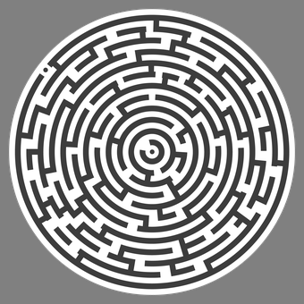

<!--
*** Thanks for checking out the Best-README-Template. If you have a suggestion
*** that would make this better, please fork the repo and create a pull request
*** or simply open an issue with the tag "enhancement".
*** Thanks again! Now go create something AMAZING! :D
***
***
***
*** To avoid retyping too much info. Do a search and replace for the following:
*** github_username, repo_name, twitter_handle, email, project_title, project_description
-->


<!-- PROJECT SHIELDS -->
<!--
*** I'm using markdown "reference style" links for readability.
*** Reference links are enclosed in brackets [ ] instead of parentheses ( ).
*** See the bottom of this document for the declaration of the reference variables
*** for contributors-url, forks-url, etc. This is an optional, concise syntax you may use.
*** https://www.markdownguide.org/basic-syntax/#reference-style-links
-->
[![Contributors][contributors-shield]][contributors-url]
[![Forks][forks-shield]][forks-url]


<!-- PROJECT LOGO -->
<br />
<p align="center">
  <a href="https://github.com/J-Magiera/Maze-Generator">
    
  </a>

  <h3 align="center">project_title</h3>

  <p align="center">
    project_description
    <br />
    <a href="https://github.com/J-Magiera/Maze-Generator"><strong>Explore the docs »</strong></a>
    <br />
    <br />
    <a href="https://github.com/J-Magiera/Maze-Generator">View Demo</a>
    ·
    <a href="https://github.com/J-Magiera/Maze-Generator/issues">Report Bug</a>
    ·
    <a href="https://github.com/J-Magiera/Maze-Generator/issues">Request Feature</a>
  </p>
</p>


<!-- TABLE OF CONTENTS -->
<details open="open">
  <summary><h2 style="display: inline-block">Table of Contents</h2></summary>
  <ol>
    <li>
      <a href="#about-the-project">About The Project</a>
      <ul>
        <li><a href="#built-with">Built With</a></li>
      </ul>
    </li>
    <li>
      <a href="#getting-started">Getting Started</a>
      <ul>
        <li><a href="#prerequisites">Prerequisites</a></li>
        <li><a href="#installation">Installation</a></li>
      </ul>
    </li>
    <li><a href="#usage">Usage</a></li>
    <li><a href="#contact">Contact</a></li>
    <li><a href="#acknowledgements">Acknowledgements</a></li>
  </ol>
</details>


<!-- ABOUT THE PROJECT -->
## About The Project

This is a maze generator project, built for STM32F429xx MC family.
It was built by [Jan Magiera](https://github.com/J-Magiera) and [Paweł Waśniowski](https://github.com/wisnia1998).
To generate maze, project utilizes depth-first search, also know as recursive backtracker algorithm.
Resources are managed by FreeRTOS. External input device communicates via UART interface with built in ring buffer.


### Built With

* [FreeRTOS](https://www.freertos.org/)


<!-- GETTING STARTED -->
## Getting Started

To get a local copy up and running follow these simple steps.

### Prerequisites

In order to use this project, you need:
* Keil uVision or other ARM IDE
  ```sh
  https://www.keil.com/download/product/
  ```
* STM32F4xx family board

* (Optional) FRDM KL05Z board


### Installation

1. Clone the repo
   ```sh
   git clone https://github.com/J-Magiera/Maze-Generator.git
   ```
2. Open ARM IDE

3. Create "New project"

4. Select Device for Target
   ```sh
   STMicroelectronics ->
	STM32F429xx family
   ```
5. Include appropriate files

6. Include all source and header files from "Display" folder

7. Compile, build and load on flash


<!-- USAGE EXAMPLES -->
## Usage

Use this space to show useful examples of how a project can be used. Additional screenshots, code examples and demos work well in this space. You may also link to more resources.

_For more examples, please refer to the [Documentation](https://example.com)_


<!-- CONTACT -->
## Contact

Your Name -  - email

Project Link: [https://github.com/J-Magiera/Maze-Generator](https://github.com/J-Magiera/Maze-Generator)


<!-- ACKNOWLEDGEMENTS -->
## Acknowledgements

* [FreeRTOS](https://www.freertos.org/)
* [WSN AGH](http://www.wsn.agh.edu.pl/)
* []()


<!-- MARKDOWN LINKS & IMAGES -->
<!-- https://www.markdownguide.org/basic-syntax/#reference-style-links -->
[contributors-shield]: https://img.shields.io/github/contributors/github_username/repo.svg?style=for-the-badge
[contributors-url]: https://github.com/github_username/repo/graphs/contributors
[forks-shield]: https://img.shields.io/github/forks/github_username/repo.svg?style=for-the-badge
[forks-url]: https://github.com/github_username/repo/network/members
[stars-shield]: https://img.shields.io/github/stars/github_username/repo.svg?style=for-the-badge
[stars-url]: https://github.com/github_username/repo/stargazers
[issues-shield]: https://img.shields.io/github/issues/github_username/repo.svg?style=for-the-badge
[issues-url]: https://github.com/github_username/repo/issues
[license-shield]: https://img.shields.io/github/license/github_username/repo.svg?style=for-the-badge
[license-url]: https://github.com/github_username/repo/blob/master/LICENSE.txt
[linkedin-shield]: https://img.shields.io/badge/-LinkedIn-black.svg?style=for-the-badge&logo=linkedin&colorB=555
[linkedin-url]: https://linkedin.com/in/github_username
